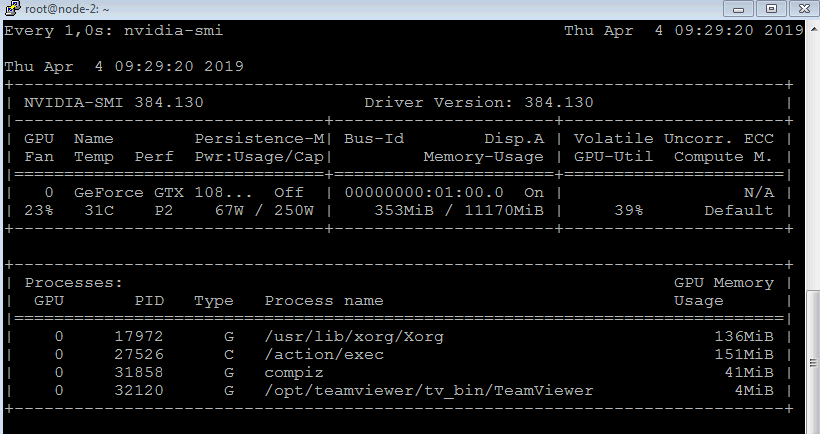

# Cuda action example

This example guides you through the creation of an action that adds elements of two arrays with a million elements each

Example code is taken from a [easier-introduction-to-cuda](https://devblogs.nvidia.com/even-easier-introduction-cuda/) blog and
was slightly modified to conform an OpenWhisk action.

Ensure the following [prerequisites](https://github.com/5g-media/incubator-openwhisk-deploy-kube/blob/gpu/docs/k8s-gpu-prerequisites.md) are met before attempting to invoke the action.

## Prepare the development environment

Now that you have setup your OpenWhisk deployment its time to create your first Cuda action. Log into one of your GPU nodes and follow the below instructions

### Run the development container

This command runs the cuda toolkit 8.0 development container that contains the tools needed to compile the example code. We pass it the local `~/.wskprops` to run the action from within the container.

```bash
docker run -it -e OPENWHISK_AUTH=`cat ~/.wskprops | grep ^AUTH= | awk -F= '{print $2}'` -e OPENWHISK_APIHOST=`cat ~/.wskprops | grep ^APIHOST= | awk -F= '{print $2}'` --rm nvidia/cuda:8.0-devel-ubuntu16.04 /bin/bash
```

Run all following commands from inside the container.

### Install required packages

```bash
apt-get update && apt-get install -y curl zip
```

## Develop the action

### Create the example

Invoke the below to create the file `add.cu` that will contain the action code:

```bash
cat <<EOF > /add.cu
#include <iostream>
#include <math.h>
// Kernel function to add the elements of two arrays
__global__
void add(int n, float *x, float *y)
{
  for (int i = 0; i < n; i++)
    y[i] = x[i] + y[i];
}

int main(void)
{
  int N = 1<<20;
  float *x, *y;

  // Allocate Unified Memory . accessible from CPU or GPU
  cudaMallocManaged(&x, N*sizeof(float));
  cudaMallocManaged(&y, N*sizeof(float));

  // initialize x and y arrays on the host
  for (int i = 0; i < N; i++) {
    x[i] = 1.0f;
    y[i] = 2.0f;
  }

  // Run kernel on 1M elements on the GPU
  add<<<1, 1>>>(N, x, y);

  // Wait for GPU to finish before accessing on host
  cudaDeviceSynchronize();

  // Check for errors (all values should be 3.0f)
  float maxError = 0.0f;
  for (int i = 0; i < N; i++)
    maxError = fmax(maxError, fabs(y[i]-3.0f));
  std::cout << "{\"message\": \"Max error: " << maxError << "\"}";

  // Free memory
  cudaFree(x);
  cudaFree(y);
  
  return 0;
}
EOF
```

### Compile and run the code to ensure it returns the expected result

```bash
nvcc add.cu -o add_cuda
./add_cuda
```

Program should return `{"message": "Max error: 0"}`

## Package the code as OpenWhisk cuda action

### Install Apache OpenWhisk CLI

```bash
curl -L https://github.com/apache/incubator-openwhisk-cli/releases/download/latest/OpenWhisk_CLI-latest-linux-amd64.tgz -o /tmp/wsk.tgz
tar xvfz /tmp/wsk.tgz -C /tmp/
mv /tmp/wsk /usr/local/bin
```

### Configure CLI

We will use the CLI to create and invoke our action

```bash
cat <<EOF > ~/.wskprops
APIHOST=$OPENWHISK_APIHOST
AUTH=$OPENWHISK_AUTH
EOF
```

### Create initialization data via a (zip) file, similar to other OpenWhisk action kinds 

```bash
mv add_cuda exec
zip myAction.zip ./exec
```

### Create the action with the above initialization data

Creating the action under kind `cuda:8@selector` tells OpenWhisk to invoke the action on Kubernetes GPU nodes
that you already labeled at the above "Prerequisites" step.

```bash
wsk -i action create cuda_Test myAction.zip --kind cuda:8@gpu
```

### Invoke the action

```bash
wsk -i -b action invoke cuda_Test
```

### Examine activation result

Activation result returns success and JSON result of the invoked action

```
    "response": {
        "result": {
            "message": "Max error: 0"
        },
        "status": "success",
        "success": true
    },
```

You can view your action running (/action/exec under Process name) via nvidia-smi utility.

* You should invoke `sudo watch nvidia-smi` on all of your GPU nodes because we do not know which host is selected to run the action
* You may need to invoke your action multiple times for it to appear due to its short liveliness



